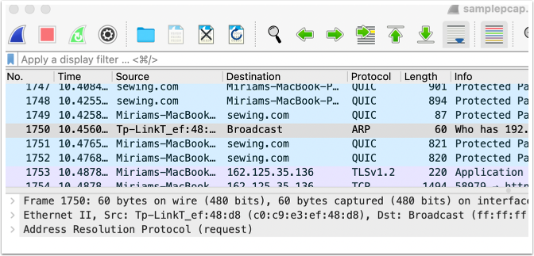

# Snoop on network activity with Wireshark

* Time: Approx. 40 min.
* Level: Beginner who has had a general introduction to packets and network protocols. I've found [this book](http://www.worldcat.org/oclc/1272923906) to be the most readable and beginner-friendly.
* Watch for: Students get overwhelmed quickly by the Wireshark interface. Be sure to position this as an exploratory exercise, one on which they will not be graded, and reassure them that they don't need to memorize this information.
* Software download: [Wireshark](https://www.wireshark.org/#download) (cross-platform)
* Credits: This tutorial is inspired by one shared with me by [Dorothea Salo](https://dsalo.info/).

If you could take a snapshot of your household's internet traffic, what would it look like? In this tutorial, we'll look at one way of viewing network activity. You might be surprised to discover how busy your network is, even when you don't think you're doing anything!

Wireshark is a \"packet sniffer,\" meaning it\'s a piece of software
that people use to observe and analyze network activity. When Wireshark is "capturing," it makes a copy of every packet traveling on your local network and displays it for your examination. It can do pretty sophisticated things \-- it\'s actually an industry standard in the field of network analysis \-- but we\'ll use it today to peek at network activity, in order to get a better sense of how the internet works.

Instructions: Working with your group, walk through the following steps together. When you get to **step 7**, you'll begin getting some questions to answer. Work with your group to discuss the answers and designate one person to submit your answers on [this
form](https://docs.google.com/forms/d/e/1FAIpQLSfVlLFCFkKvrzzsNYNX8JR7HTra-_zpzbu4auzmQPpH4BF61A/viewform?usp=sf_link).

## 1. Download the capture file

Go to
<https://bruinlearn.ucla.edu/files/7715424/download?download_frd=1> to
download our PCAP file. PCAP stands for "packet capture" and is the
standard file format for viewing network activity. Save the file
someplace where you\'ll be able to find it easily. You don\'t have to
open it quite yet.

The picture below is an excerpt from a [newspaper article](https://www.azmirror.com/blog/inspired-by-mike-lindell-republicans-demand-information-from-elections-officials/) about Republican attempts to prove that voter fraud took place over networks. You can see that PCAPs are the standard way network experts analyze network activity.

## 2\. Open Wireshark

Double-click on Wireshark to open it. You\'re greeted with a welcome
screen.

(Note: If Wireshark starts capturing as soon as you open it \-- you can tell because the main window will immediately fill with lines of text\-- press the stop sign next to the shark fin at the top left of the Wireshark window. Then continue.)

## 3. Open the sample PCAP file.

Click on **File**, then **Open**, and then find the file you downloaded in step 1.

(If you had to press the stop sign in the previous step, Wireshark may
ask you if you want to \"save the current capture.\" You don\'t. Press
\"continue without saving.\")

## 4. What are you looking at?

Wireshark\'s interface consists of three main panes. The first, the main window, contains a list of all the network activity Wireshark observed during the capture period. (The colors of the highlighting on your version might be different from mine.) [What are the color
codes?](https://www.wireshark.org/docs/wsug_html_chunked/ChCustColorizationSection.html) The second, the middle window, gives you information about the highlighted line. The third, bottom window contains the actual message,
in bytes. Usually it\'s hard to read because it\'s in hexadecimal and then ASCII code. You can minimize that bottom window, if you want.

## 5. Anatomy of a packet

The number column **(1)** tells you which line you\'re on in your list
of packets. That also serves as a good way to identify which packet
you\'re talking about. The Time column **(2)** tells you how many
seconds have elapsed since the capture started. Source **(3)** is the network address (IP address) from which the packet was generated. Destination **(4)** is the IP address to which the packet was sent. Protocol **(5)**, of course, tells you which protocol was contained in the packet. Length **(6)** tells you how many characters the packet contains. And Info **(7)** gives you more information about the request.

## 6. Get some information about the PCAP

There are so many lines here, it\'s hard to tell what\'s going on.
Let\'s try to get an overview of the entire capture. From the
**Statistics** menu at the top of your screen, choose **Capture File
Properties**. In the ensuing window, you can get some useful information about the PCAP: for example, it captures 12 seconds of activity and 1,961 packets. (You can also tell what kind of computer I have!)

## 7. Snoop on my web activity

In the 12 seconds that elapsed, I visited some websites. Remember, every time I typed a URL in my browser, my browser sent out a DNS request, in order to translate that URL into a website address. So let\'s just look at DNS requests. In the **Display filter** window above the main pane, type **dns**. The search box will turn green when you\'ve entered a kind of protocol that Wireshark understands; you can\'t just enter anything!
Press enter.

Now you\'ll see only DNS requests.

**Question 1: Can you tell what my favorite hobby is?** (Hint: look
carefully at the Info column.)

**Question 2: I only entered two URLs during the capture period.** **Why do you think there are so many DNS requests during this period?**

## 8. Make the addresses a little easier to read.

Delete the dns filter from the **Display filter** window by clicking on the tiny **x** at the far right of the search bar. You should now see all the packets again, not just the dns packets. It might make your work a little easier if you convert the IP addresses into human-readable
names. From the **View** menu, choose **Name resolution** and check
**Resolve network addresses.** Wireshark won\'t be able to resolve every address ([why
not](https://documentation.help/Wireshark/ChAdvNameResolutionSection.html)?)
but it will make some IP addresses easier to read.

## 9. See the protocol breakdown

Let\'s look at the percentage breakdown of the various protocols. From the **Statistics** menu, select **Protocol Hierarchy**. This tells you what percentage of packets contain each kind of protocol. Why do the numbers add up to more than 100%? That\'s because each packet actually contains multiple protocols, even though Wireshark has divided them up
in the main window so that you can focus on each protocol, one at a
time.

**Question 3: Most packets contain either TCP or UDP protocols. Why
would that be?**

**Question 4: What\'s the Address Resolution Protocol? What\'s it doing there?**

{width="6.21875in"
height="5.145833333333333in"}

## 10. Investigate a packet

Scroll down to line 1750. It looks a little different from the others.

**Question 5: Can you tell what\'s going on in here?** (Feel free to
Google terms.)

## 11. Background noise

If your computer is connected to the internet, it\'s always chattering away, even if you\'re not doing anything.

**Question 6: Can you tell what service I use to sync my files to the cloud?** (Hint: Start from the first line and scroll down slowly. You should be able to figure this out by the time you get to line 300.)

## 12. Capture your own activity

WARNING: this file will get big FAST, especially since you\'re running Zoom, so start and stop the capture within a few seconds!

OK, want to see what someone could see if they sniffed packets on your
network? It\'s easy to capture packets!

Click on the blue sharkfin at the top left of the Wireshark interface.

You may be presented with a screen like that pictured in step 2, in
which you are asked to choose between various kinds of network
connections, like Wi-Fi, ethernet, and a bunch of uninterpretable names.You probably want wifi \-- pick the connection that has the most activity, as shown in its corresponding line graph.

Then VERY QUICKLY click on the stop sign right next door to the shark
fin. By default Wireshark\'s captures are \"promiscuous,\" meaning they capture not only your own activity but the activity of every device on the same network as you.

**Question 7: What do you see? What could someone tell about you and
your household from a few seconds of your network activity?**

